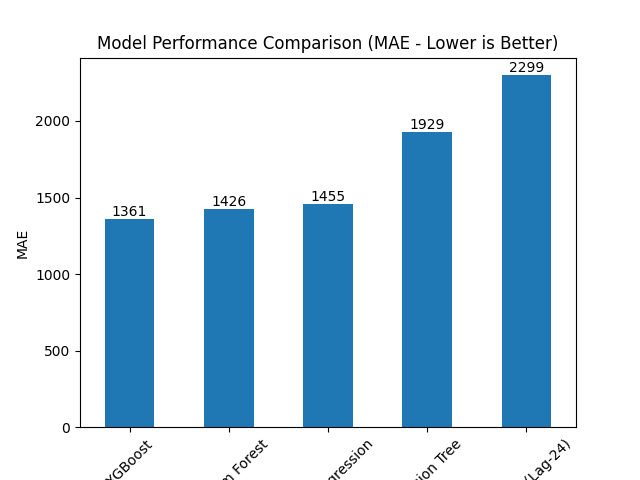
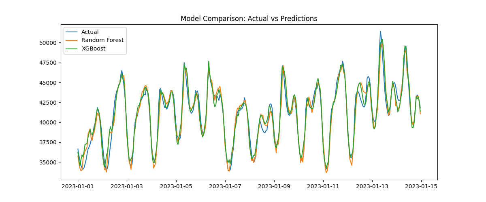
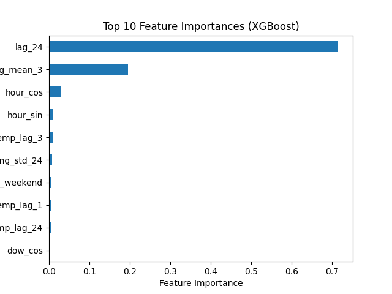

# Electricity Demand Forecasting

Predicting hourly electricity demand using time-series feature engineering and machine learning models.
---

## 🚀 Live Demo
👉 [Try the Electricity Demand Forecasting](https://grid-demand-forecast.streamlit.app/)

---

## Overview

Electricity demand exhibits strong temporal patterns driven by daily cycles, weekly behavior, and weather conditions.
This project builds an end-to-end forecasting pipeline to predict hourly electricity demand using historical load and temperature data.

The objective is to develop models that improve upon a seasonal baseline and capture nonlinear relationships in demand patterns.

---

## Problem Statement

* **Target:** Hourly electricity demand (MW)
* **Horizon:** Short-term forecasting
* **Use case:** Grid operators for demand planning and resource allocation

---

## Dataset

* **Source:** EIA Grid Monitor (Texas region) + Open-Meteo weather data
* **Granularity:** Hourly
* **Time Range:** 2018 – 2023

### Features

* Historical demand (lag features)
* Rolling statistics (short & long-term trends)
* Weather (temperature + lagged temperature)
* Calendar features (hour, day, month)
* Cyclical encoding of time features

---

## Feature Engineering

Key transformations:

* **Lag Features:** `lag_24`, `lag_48`, `lag_168`
* **Rolling Features:** moving averages and standard deviation
* **Cyclical Encoding:**

  * hour → sin/cos
  * day_of_week → sin/cos
  * month → sin/cos
* **Weather Features:** temperature + lagged temperature

These features capture seasonality, trends, and external drivers of demand.

---

## Models

The following models were evaluated:

1. **Seasonal Naive (Baseline)** – previous day demand
2. **Linear Regression** – strong baseline with engineered features
3. **Decision Tree** – captures nonlinear splits (overfitting observed)
4. **Random Forest** – reduces variance via ensemble averaging
5. **XGBoost** – gradient boosting for improved accuracy

---

## Results

| Model             | MAE (MW)  | MAPE (%)  |
| ----------------- | --------- | --------- |
| Baseline (Lag-24) | ~2299     | ~4.65     |
| Linear Regression | ~1673     | ~3.28     |
| Decision Tree     | ~1929     | ~3.57     |
| Random Forest     | ~1426     | ~2.53     |
| **XGBoost**       | **~1360** | **~2.40** |

---

## Key Visualizations

### Model Comparison


### Final Predictions (Actual vs Models)


### Feature Importance (XGBoost)


---

## Key Insights

* Electricity demand shows strong **daily and weekly seasonality**
* Lag features (especially **lag_24**) are highly predictive
* Temperature significantly impacts demand (nonlinear effect)
* **Feature engineering is critical** — even linear models perform well
* Ensemble methods outperform individual models:

  * Random Forest reduces overfitting
  * XGBoost captures complex interactions and performs best
* Deployed with a 5-tier demand alert system (Normal → Critical) based on hourly percentile thresholds, translating predictions into grid operator actions.

---

## Conclusion

The XGBoost model achieves the best performance, significantly improving over the seasonal baseline.

This project demonstrates that combining **domain-aware feature engineering with ensemble models** leads to accurate and robust electricity demand forecasts.

---

## Future Improvements
* Integrate real-time weather forecast API for live predictions
* Extend to multi-step forecasting (next 24 hours)
* Implement rolling cross-validation for temporal robustness
* Incorporate additional weather variables (humidity, wind speed)

---

## Project Structure

```
electricity-demand-forecasting/
│
├── notebooks/
│   ├── 01_datasanity.ipynb
│   ├── 02_feature_engineering.ipynb
│   ├── 03_baseline.ipynb
│   └── 04_ml_models.ipynb
│
├── data/
│   ├── raw/
│   └── processed/
│
├── reports/
│   ├── figures/
│   └── summary_tables/
│
├── src/
├── README.md
└── requirements.txt
```

---

## How to Run

1. Clone the repository
2. Install dependencies:

```
pip install -r requirements.txt
```

3. Run notebooks in order:

```
01 → 02 → 03 → 04
```

---

## Tech Stack
* Python
* Pandas, NumPy
* Scikit-learn
* XGBoost
* Matplotlib
* Streamlit

---

## 📌 Author

Pratik Singh

Aspiring Data Scientist with a focus on machine learning, time-series forecasting, and building end-to-end data projects.

---